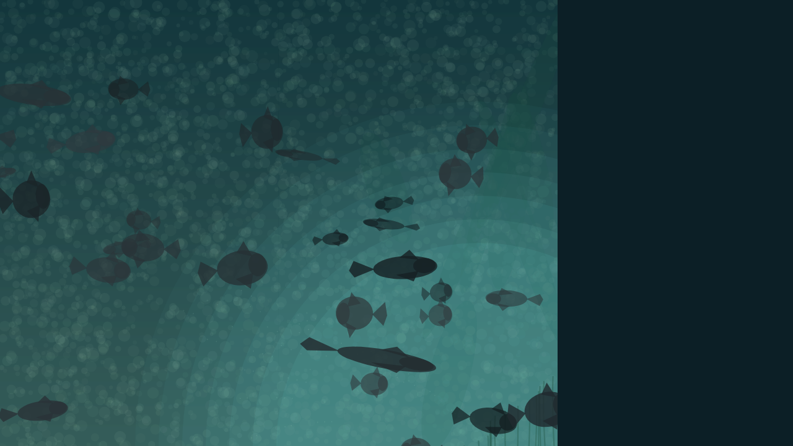

# Fish Loop (p5.js)

A looping generative art sketch in p5.js inspired by an underwater fish-silhouette scene.

## Screenshot



## What it does

- Renders a murky underwater environment with haze, depth, and soft light bloom.
- Draws a school of silhouette fish at varied sizes and depths.
- Animates fish with horizontal swimming, vertical bobbing, and tail swish.
- Uses periodic motion so the animation loops seamlessly.

## Loop settings

- Duration: `8` seconds
- Framerate: `60` FPS
- Total loop frames: `480`

## Files

- `index.html` - page shell and p5.js import
- `sketch.js` - full animation logic

## Run locally

From this project folder:

```bash
python3 -m http.server 8010
```

Then open:

- <http://127.0.0.1:8010/index.html>

## Notes

To keep the loop clean, fish motion cycles are constrained to integer cycle counts over the loop duration.
